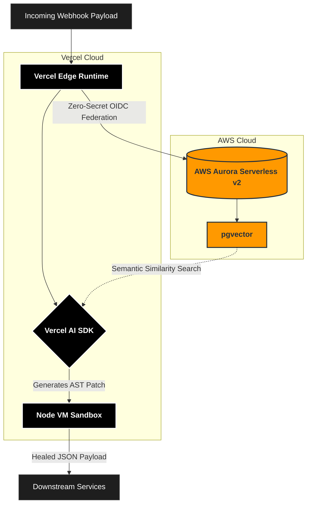

<div align="center">
  <h1>SUNDER</h1>
  <p><strong>An Autonomous Data Immune System</strong></p>
  <p><em>Built for the "H0: Hack the Zero Stack" Hackathon</em></p>

  [](https://nextjs.org/)
  [](https://aws.amazon.com/)
  [](https://vercel.com/)
  [](https://clerk.dev/)
</div>

---

## ⚡ The Elevator Pitch
B2B engineering teams face a massive crisis: **Semantic Schema Drift**. When third-party APIs (like Stripe or Shopify) silently mutate their data structures, it instantly breaks downstream ingestion pipelines. Traditional monitoring tools only flag type errors, missing semantic changes entirely. 

Sunder acts as a reverse proxy for your enterprise webhooks. It mathematically proves structural drift in milliseconds, and autonomously generates a JavaScript patch to remap the invalid JSON on the fly. Clean data keeps flowing, preventing downstream services from crashing.

---

## 🏗️ The Zero-Secret Architecture

We built Sunder strictly adhering to the "Zero-Secret" philosophy, leveraging the absolute cutting edge of the Vercel and AWS ecosystems.



### Core Technologies
* **v0 by Vercel:** Rapid generation of the cinematic, glassmorphic Next.js UI.
* **Vercel AI SDK:** Dynamic generation of AST (Abstract Syntax Tree) JavaScript payload-remapping logic.
* **AWS Aurora Serverless v2 & pgvector:** High-speed semantic similarity search \(\langle \vec{a}, \vec{b} \rangle\) across Aurora using `pgvector` to instantly compare incoming payloads against expected historical schemas.
* **Vercel OIDC (Zero-Secret):** To achieve enterprise security, we completely eliminated hardcoded AWS passwords. Sunder uses Vercel's official OpenID Connect (OIDC) Federation to dynamically assume AWS IAM roles using short-lived, ephemeral STS tokens.
* **Clerk:** Secure, drop-in user authentication.

---

## 🚀 How Sunder Heals Data

Sunder dynamically heals complex semantic drift, such as:
1. **Deep Nesting:** A provider stops sending `customer_email` at the root level and buries it inside a nested `user: { contact: { email: "..." } }` object.
2. **Type Mutations:** A payment gateway silently switches an `amount: 100` (integer) to `amount: "100.00"` (string), which would normally crash a strict SQL database.
3. **Format Shifts:** A vendor switches from Unix timestamps (`1719244800`) to ISO-8601 strings (`"2026-06-29T14:00:00Z"`).

---

## 🛠️ Running Locally

1. Clone the repository
2. Install dependencies:
```bash
npm install
```
3. Set up your `.env.local` with your Clerk Development Keys:
```env
NEXT_PUBLIC_CLERK_PUBLISHABLE_KEY=pk_test_...
CLERK_SECRET_KEY=sk_test_...
```
*(Note: AWS Aurora is accessed dynamically via Vercel OIDC Federation in production. No local AWS credentials are required to run the visual dashboard simulation).*

4. Run the development server:
```bash
npm run dev
```
